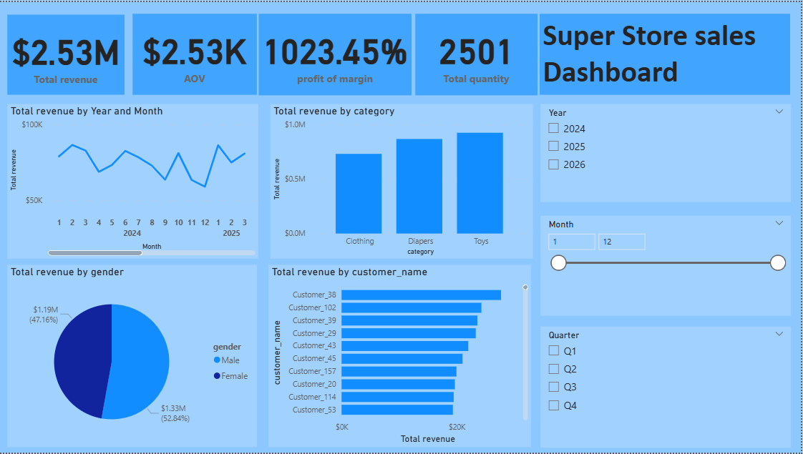
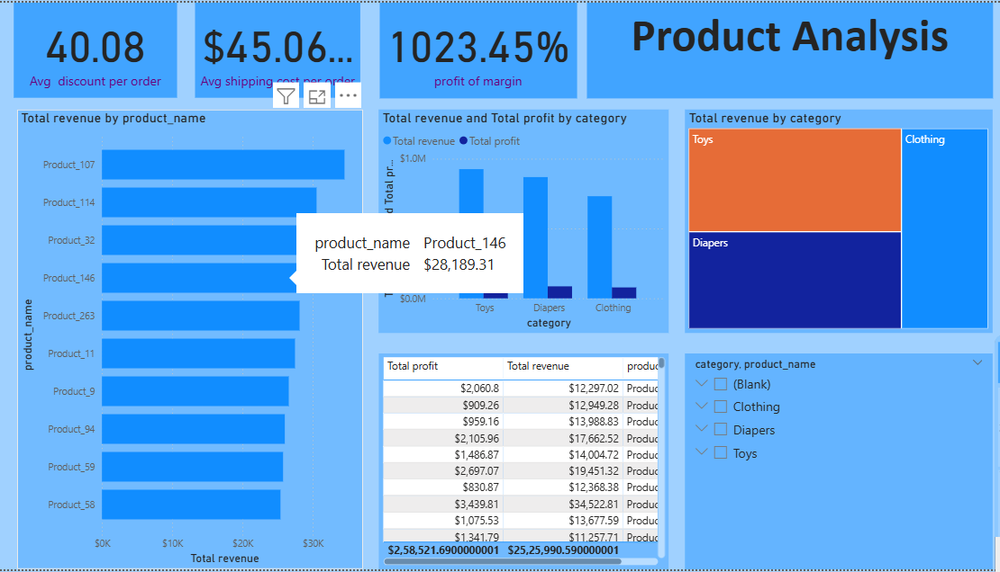
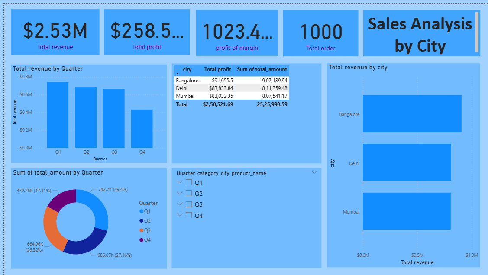
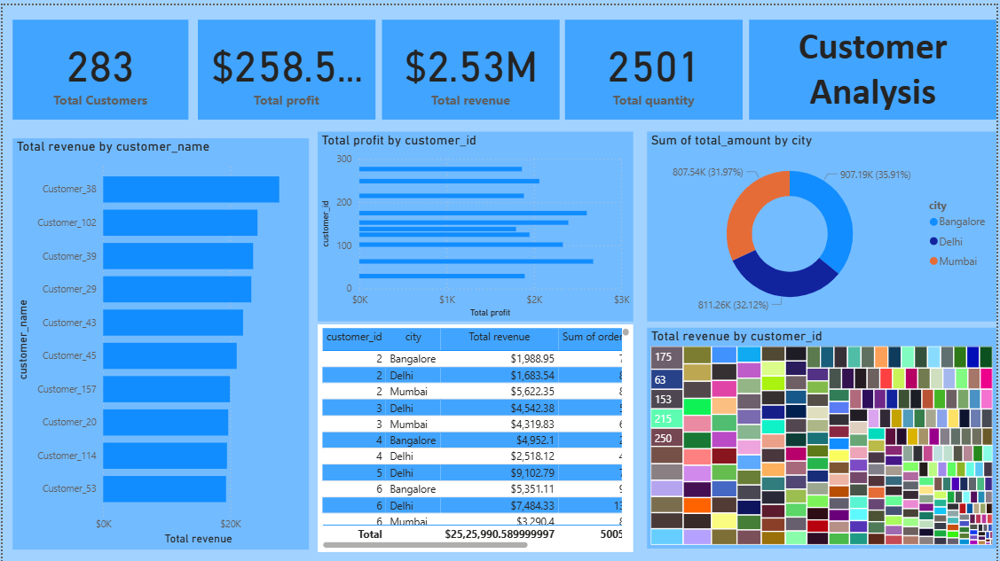
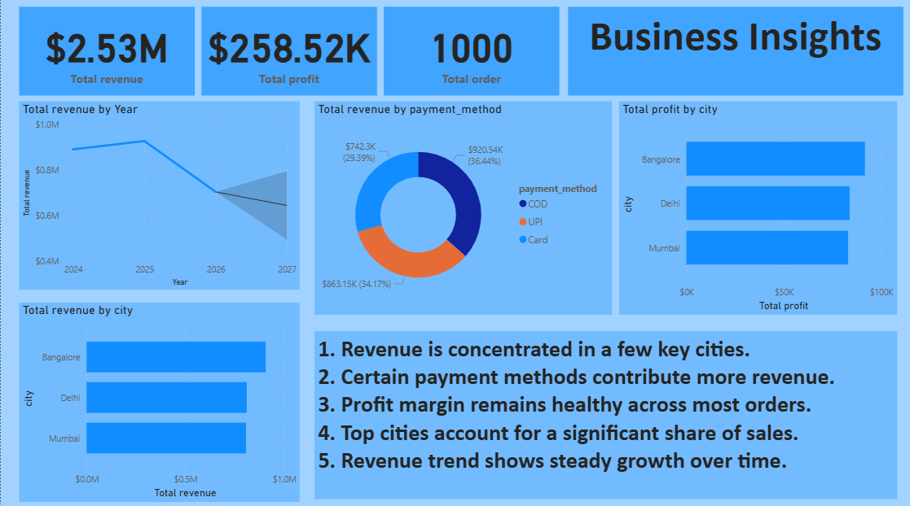

# PowerBI
# 📊 Super Store Sales Dashboard — Power BI Project


---

## 📌 Project Overview

This project presents an interactive **Power BI Sales Analytics Dashboard** built using a Super Store sales dataset. The dashboard provides comprehensive insights into sales performance, product profitability, customer behavior, regional trends, and future sales forecasting to support data-driven business decisions.

---

## 📊 Dashboard Preview

### Executive Summary Dashboard


### Product Analysis Dashboard


### Regional Analysis Dashboard


### Customer Analysis Dashboard


### Business Insights Dashboard


---

## 🎯 Key Metrics Tracked

| Metric | Value |
|---------|---------|
| Total Revenue | $2.53M |
| Total Profit | $258.52K |
| Average Order Value (AOV) | $2.53K |
| Profit Margin | 10.23% |
| Total Orders | 1000+ |
| Total Customers | 283 |
| Total Quantity Sold | 2501 |

---

## 📈 Dashboard Pages

### 1️⃣ Executive Summary

- Revenue Overview
- Profit Analysis
- Profit Margin Tracking
- Revenue Trend Analysis
- Revenue by Category
- Top Customer Performance
- Dynamic Filtering

### 2️⃣ Product Analysis

- Top Products by Revenue
- Product Profitability Analysis
- Category-wise Revenue Distribution
- Revenue vs Profit Comparison
- Product Performance Ranking
- Product Category Treemap

### 3️⃣ Regional Analysis

- Revenue by City
- Profit by City
- Quarterly Revenue Analysis
- Revenue Distribution by Quarter
- City Performance Comparison
- Regional Contribution Analysis

### 4️⃣ Customer Analysis

- Top Customers by Revenue
- Customer Profitability Analysis
- Customer Revenue Contribution
- City-wise Customer Distribution
- Customer Performance Dashboard
- Revenue Concentration Analysis

### 5️⃣ Business Insights & Forecast

- Revenue Trend Forecasting
- Revenue by Payment Method
- Profit Analysis by City
- Business Insight Reporting
- Future Revenue Projection
- Interactive Performance Monitoring

---

## 📁 Project Structure

```text
superstore-sales-dashboard/
│
├── Super Store sales.pbix
├── dashboard_images/
│   ├── executive_dashboard.png
│   ├── product_analysis.png
│   ├── regional_analysis.png
│   ├── customer_analysis.png
│   └── business_insights.png
│
├── dataset/
│   └── superstore_dataset.xlsx
│
└── README.md
```

---

## 🗂️ Dataset Summary

- Dataset Type: Retail Sales Data
- Records: 1000+ Transactions
- Categories: Clothing, Toys, Diapers
- Cities: Bangalore, Delhi, Mumbai
- Customer Count: 283
- Time Period: 2024 – 2026

---

## 🛠️ Tools Used

| Tool | Purpose |
|---------|---------|
| Power BI Desktop | Dashboard Development |
| Power Query | Data Cleaning & Transformation |
| DAX | KPI Calculations & Measures |
| Excel | Data Source |
| Data Modeling | Relationship Management |

---

## 📊 DAX Measures Created

```DAX
Total Revenue = SUM(Factsales[total_amount])

Total Profit = SUM(Factsales[profit])

Total Orders = DISTINCTCOUNT(Factsales[order_id])

AOV = DIVIDE([Total Revenue],[Total Orders])

Profit Margin = DIVIDE([Total Profit],[Total Revenue])
```

---

## 🚀 How to Run This Project

### 1. Clone the Repository

```bash
git clone https://github.com/Chandruvenkat-01/superstore-sales-dashboard.git
```

### 2. Open Power BI File

Open:

```text
Super Store sales.pbix
```

using Power BI Desktop.

### 3. Refresh Data Source

- Home → Transform Data
- Update file path if required
- Click Refresh

### 4. Explore Dashboard

Use slicers and filters to analyze:

- Year
- Month
- Quarter
- Category
- Product
- City
- Customer

---

## 💡 Key Insights

- Generated over $2.53M in total revenue.
- Achieved $258.52K in total profit.
- Bangalore contributed the highest sales revenue.
- Revenue is concentrated among a few high-value customers.
- Certain product categories generate higher profitability.
- Payment methods significantly impact revenue contribution.
- Forecasting indicates stable future revenue growth.

---

## 🎓 Skills Demonstrated

- Data Analysis
- Business Intelligence
- Data Visualization
- Dashboard Development
- DAX Calculations
- Power Query
- Data Modeling
- KPI Development
- Forecasting
- Business Reporting

---

## 👨‍💻 Author

### Chandru Venkatasamy

📧 chandruvenkatasamy2985@gmail.com

🔗 LinkedIn: https://www.linkedin.com/in/chandruvenkatasamy

🔗 GitHub: https://github.com/Chandruvenkat-01

---

## ⭐ Project Highlights

✔ Interactive Dashboard Design

✔ Multi-Page Business Reporting

✔ Customer & Product Analytics

✔ Forecasting & Trend Analysis

✔ Business Insight Generation

✔ End-to-End Power BI Solution

---

## 📄 License

This project is created for educational, portfolio, and learning purposes.
